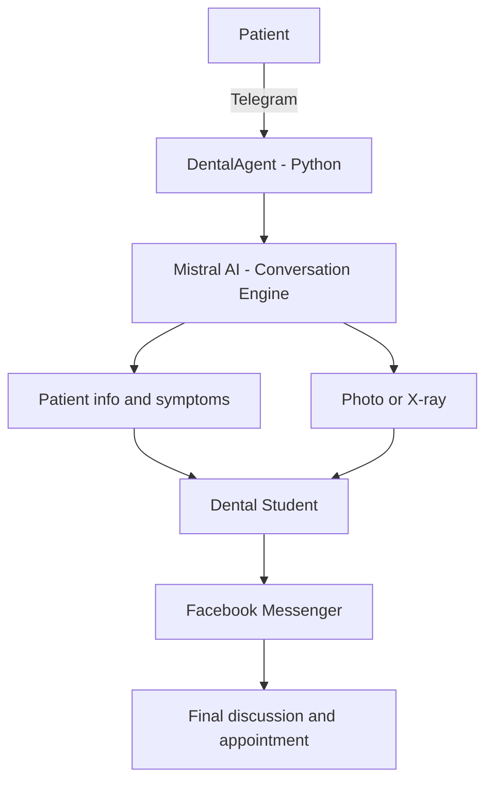
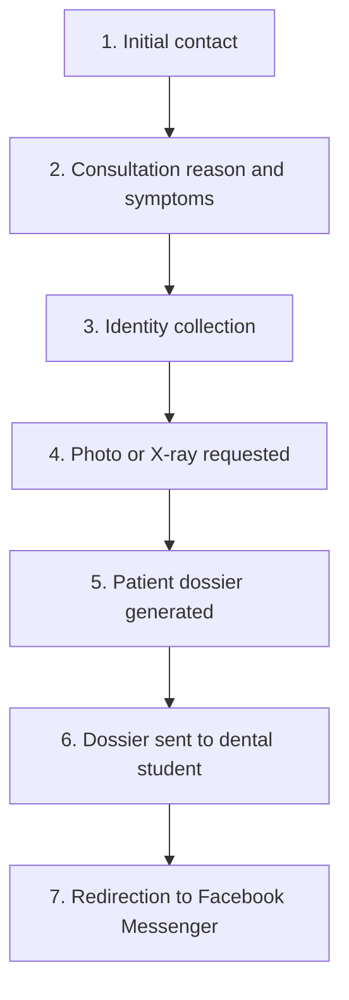
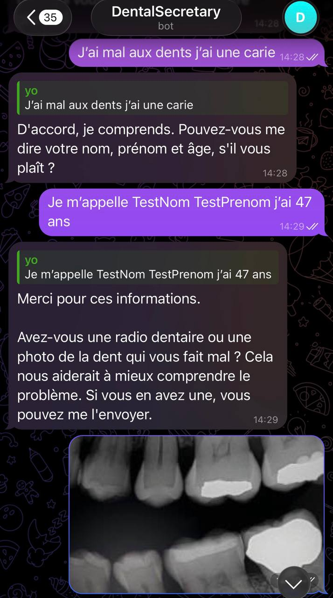
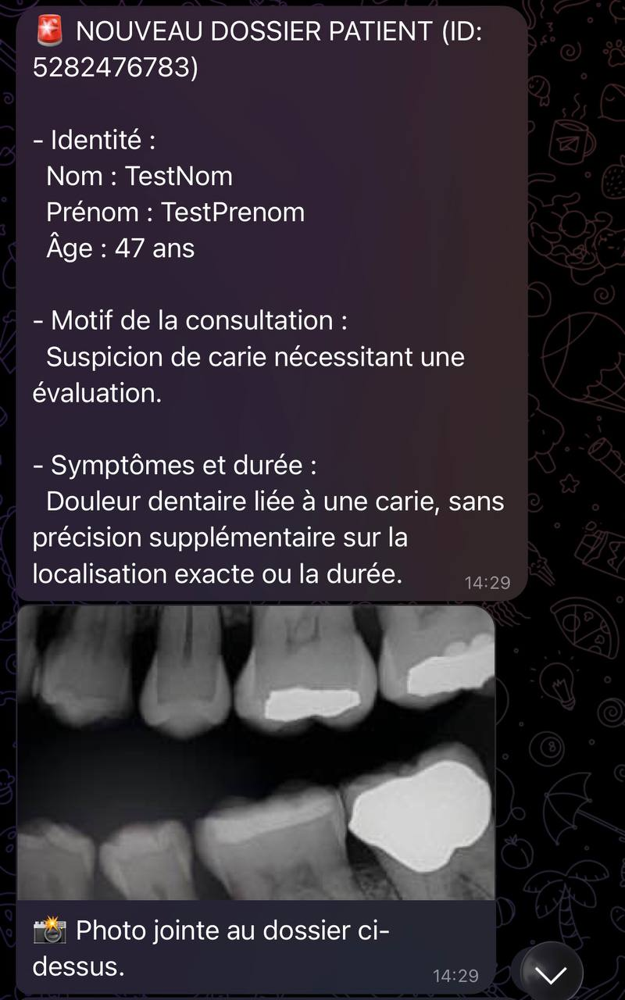

# DentalAgent

<p align="center">
  
  
  
</p>

<p align="center">
  <strong>AI-powered Telegram dental pre-consultation assistant</strong>
</p>

<p align="center">
  DentalAgent helps dental students collect patient information,<br>
  prepare a patient dossier and receive medical images through Telegram.
</p>

---

## Overview

DentalAgent is a Telegram-based AI assistant designed to handle the **pre-consultation stage** of a dental interaction.

The AI Agent uses Mistral AI to:

* communicate naturally with patients;
* automatically adapt to the patient's language, either Romanian or French;
* collect identity and consultation information;
* ask for a photo or X-ray when necessary;
* generate a concise patient summary;
* forward the patient's dossier and image to the dental student.

After the pre-consultation, the patient is redirected to the dental student's personal Facebook Messenger for the final discussion and appointment.

> DentalAgent does not provide medical diagnoses. The final assessment and appointment are handled by the dental student.

## Agent Design

DentalAgent follows a **Deliberative / Planning Agent** architecture: rather than reacting to each message in isolation, the agent reasons about the current stage of the conversation (identity, symptoms, imaging, summary) and plans its next action accordingly before responding.

## Project Structure

```text
DentalAgent/
├── agent.py
├── requirements.txt
├── README.md
├── LICENSE
├── .gitignore
└── .env
```

## Architecture



## Features

* AI-powered patient conversations
* Automatic language adaptation
* Patient identity collection
* Consultation reason and symptom collection
* Photo / X-ray collection
* Automatic patient case summary
* Patient dossier sent to the dental student
* Medical image forwarded with the dossier
* Telegram-based administration
* Per-patient conversation history
* Redirection to Facebook Messenger

## Patient Workflow



## Patient Experience

The patient interacts entirely through Telegram during the pre-consultation.

The assistant adapts its language automatically depending on the language used by the patient.

### Example — Patient Conversation

<p align="center">
  
</p>

## Dental Student Experience

When the patient sends a photo or X-ray, DentalAgent:

1. retrieves the patient's conversation history;
2. generates a structured summary;
3. sends the summary to the dental student's Telegram;
4. sends the original image separately.

### Example — Patient Dossier

<p align="center">
  
</p>

The generated summary follows this structure:

```text
NOUVEAU DOSSIER PATIENT

- Identité : Nom, Prénom, Âge.
- Motif de la consultation : ...
- Symptômes et durée : ...

Photo jointe au dossier.
```

The patient-facing conversation can take place in Romanian or French, while the dossier sent to the dental student is always generated in French.

## Technology Stack

| Technology       | Usage                                          |
| ---------------- | ----------------------------------------------- |
| Python           | Main programming language                       |
| Mistral AI       | Patient conversation and dossier summarization   |
| Telegram Bot API | Patient and dental student communication         |
| pyTelegramBotAPI | Telegram integration                             |
| python-dotenv    | Environment variable management                 |
| Google Cloud     | Deployment / infrastructure                      |

## Installation

Clone the repository:

```bash
git clone https://github.com/IsaacKaba/DentalAgent.git
cd DentalAgent
```

Create a virtual environment:

```bash
python -m venv .venv
```

### Windows

```powershell
.venv\Scripts\Activate.ps1
```

### Install dependencies

```bash
pip install -r requirements.txt
```

## Environment Variables

Create a `.env` file in the project root:

```env
TELEGRAM_TOKEN=your_telegram_token
MISTRAL_API_KEY=your_mistral_api_key
ADMIN_CHAT_ID=your_admin_chat_id
DENTIST_NAME=your_dentist_name
DENTIST_LINK=your_facebook_profile_link
```

Never commit `.env` to Git.

## Usage

Start the bot:

```bash
python agent.py
```

The terminal should display:

```text
Telegram bot is online.
```

The bot is then ready to receive Telegram messages.

## Deployment on Google Cloud

DentalAgent runs on a **Compute Engine e2-micro instance**, which is free for life within Google Cloud's Always Free tier.

1. **Push the code to GitHub** — commit `agent.py`, `requirements.txt`, etc. Make sure `.env` is listed in `.gitignore` so your keys are never pushed.
2. **Create the server** — in Google Cloud Console, create a Compute Engine instance of type `e2-micro`, running Ubuntu, in a US region such as `us-central1` (required to stay within the free tier).
3. **Open the SSH terminal** directly from the Google Cloud Console (browser-based), then set up the project:

   ```bash
   git clone <your_github_repo_url>
   cd DentalAgent
   sudo apt update && sudo apt install python3-pip python3-venv
   pip install -r requirements.txt
   ```

4. **Recreate the secrets file** on the VM:

   ```bash
   nano .env
   ```

   Paste in your Mistral and Telegram keys, then save.

5. **Keep the bot running in the background.** A normal `python3 agent.py` stops as soon as you close the SSH session. Run it with `nohup` instead so it keeps running after you disconnect:

   ```bash
   nohup python3 agent.py &
   ```


The AI does not diagnose the patient. The dental student receives the collected information and image and handles the final assessment directly with the patient.

## License

This project is licensed under the MIT License.

See the [LICENSE](LICENSE) file for the full license text.
